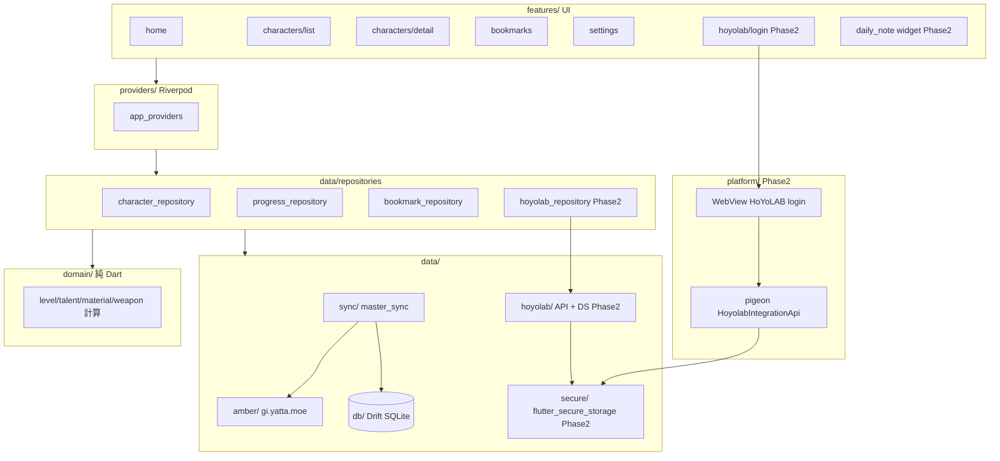
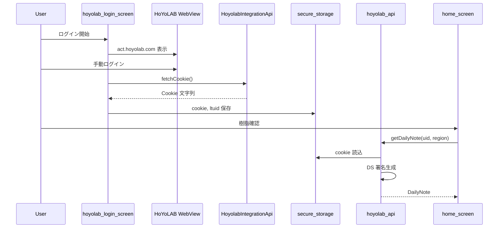

# Architecture — Genshin Builder Mobile

原神育成管理の **非公式** Flutter アプリ。  
仕様の正は Web 版 `../genshin-builder-app/`。参考実装は [genshin_material](https://github.com/chika3742/genshin_material)（MIT 相当のオープンソース。コードは **コピーせず概念のみ参考** し、本プロジェクト用に書き直す）。

---

## 1. 全体像



---

## 2. Phase 分け

| Phase | スコープ | 完了条件 |
|-------|----------|----------|
| **Phase 1** | 育成 UI + 素材計算 + ブックマーク + Amber 同期 + **Drift DB** | Web と同じ数値・同じブックマーク仕様でキャラ詳細が動作 |
| **Phase 2** | HoYoLAB 連携（WebView ログイン・dailyNote・設定 UI） | WebView ログイン → Cookie 保存 → dailyNote 表示 |
| Phase 3（将来） | 聖遺物スコア・Firebase 等 | 未定 |

### Phase 1 — 詳細

| 領域 | 内容 | Web 参照 |
|------|------|----------|
| **ドメイン** | Lv/突破/天賦/武器 EXP・範囲合算 | `level-progression.ts`, `talent-progression.ts`, `material-requirements.ts`, `weapon-exp.ts` |
| **DB** | Drift（Prisma スキーマ相当 + bookmarks） | `prisma/schema.prisma`, `bookmark-storage.ts` |
| **同期** | Project Amber → Drift upsert | `api/project-amber.ts`, `sync.ts`, `sync-upgrade.ts` |
| **UI** | キャラ詳細（Lv/天賦/武器スライダー、次段階/範囲素材、ブックマーク） | `DetailEditor`, `LevelMaterialsPanel`, `TalentSection`, `WeaponSection`, `MarkSlider` |
| **ブックマーク** | materialId 合算、キャラアイコン、sourceKey 規約 | `bookmark-utils.ts`, `MaterialBookmarkContext`, `HomeWithBookmarks` |

**Phase 1 でやらないこと**: Cookie / UID / HoYoLAB API / DS 署名

### Phase 2 — 詳細（今回: 設計 + 骨組みまで）

| 領域 | 内容 | genshin_material 参考 |
|------|------|------------------------|
| **WebView ログイン** | HoYoLAB にログインし Cookie 取得 | Pigeon `HoyolabIntegrationApi.fetchCookie()` + ネイティブ WebView |
| **Secure Storage** | Cookie・region・uid を端末内暗号化保存 | `flutter_secure_storage` |
| **API クライアント** | dailyNote（樹脂・デイリー）、verifyLToken | `lib/core/hoyolab_api.dart`（DS salt / app_version は自前定数で管理） |
| **UI** | 設定 → ログイン、ホーム → 樹脂ウィジェット | pages 相当を features/hoyolab に再構成 |

**Phase 2 骨組み** = インターフェース・空実装・ルート・Provider まで。API バージョン追従は設定画面から app_version を更新できる設計を検討。

---

## 3. ディレクトリ構成（目標）

```
genshin-builder-mobile/
├── lib/
│   ├── main.dart
│   ├── app.dart
│   ├── router.dart
│   │
│   ├── domain/                    # 純 Dart（Flutter/DB 非依存）
│   │   ├── level_config.dart
│   │   ├── level_progression.dart
│   │   ├── talent_progression.dart
│   │   ├── material_requirements.dart
│   │   ├── weapon_exp.dart
│   │   └── models/
│   │
│   ├── data/
│   │   ├── db/                      # Drift（Phase 1）
│   │   │   ├── app_database.dart
│   │   │   ├── tables/
│   │   │   └── daos/
│   │   ├── amber/
│   │   ├── sync/
│   │   ├── repositories/
│   │   ├── hoyolab/                 # Phase 2 骨組み
│   │   │   ├── hoyolab_api.dart
│   │   │   ├── hoyolab_auth.dart    # DS 署名
│   │   │   ├── hoyolab_session.dart
│   │   │   └── models/daily_note.dart
│   │   └── secure/                  # Phase 2 骨組み
│   │       └── secure_storage_service.dart
│   │
│   ├── platform/                    # Phase 2 骨組み
│   │   └── pigeon/
│   │       ├── hoyolab_integration.dart   # @HostApi 定義
│   │       └── hoyolab_integration.g.dart   # codegen
│   │
│   ├── features/
│   │   ├── home/
│   │   ├── characters/
│   │   │   ├── character_list_screen.dart
│   │   │   ├── character_detail_screen.dart
│   │   │   └── widgets/             # Level/Talent/Weapon パネル分割
│   │   ├── bookmarks/
│   │   ├── settings/
│   │   └── hoyolab/                 # Phase 2 骨組み
│   │       ├── hoyolab_login_screen.dart
│   │       └── widgets/daily_note_card.dart
│   │
│   └── providers/
│
├── pigeon/hoyolab_integration.dart    # Pigeon 入力（Phase 2）
├── docs/
│   ├── PHASE1_IMPLEMENTATION.md
│   ├── PHASE2_HOYOLAB.md
│   └── AGENT_MEMORY.md
├── ARCHITECTURE.md
└── test/domain/
```

---

## 4. データ層

### 4.1 ランタイム DB（sqflite）と Drift 移行準備

**現状**: ランタイムは `sqflite_database.dart`（`app_database.dart` から export）。  
**Drift**: `lib/data/db/drift/` に tables / daos 定義済み。codegen 後に切替予定。  
共有: `lib/data/db/upgrade_serde.dart` で突破 JSON の encode/decode を一元化。

| テーブル | 用途 |
|----------|------|
| `characters`, `weapons`, `materials` | Amber マスタ |
| `character_upgrades`, `weapon_upgrades`, `level_exp_segments` | 突破・天賦・EXP |
| `user_progress` | 育成スライダー状態 |
| `material_bookmarks` | 素材ブックマーク |
| `sync_logs` | 同期履歴 |
| `app_settings` | 匿名 userId、最終同期時刻（Phase 2 で HoYoLAB 設定キー追加） |

Codegen: `dart run build_runner build --delete-conflicting-outputs`

### 4.2 Project Amber

- Base: `https://gi.yatta.moe`
- 一覧: `/avatar`, `/weapon`, `/material`
- 詳細: `/avatar/{id}`, `/weapon/{id}` → promotes / talents JSON
- Web と同一正規化（元素・武器種マップ）

### 4.3 HoYoLAB（Phase 2）



**DS 署名**（グローバル版、参考実装と同原理・自前実装）:

```
salt = "okr4obncj8bw5a65hbnn5oo6ixjc3l9w"  # 中国版とは異なる
t = unix_timestamp
r = random 6 digits
q = query string (sorted)
c = md5("salt={salt}&t={t}&r={r}&b={body}&q={q}")
DS = "{t},{r},{c}"
```

**主要エンドポイント（Phase 2 優先）**:

| API | URL | 用途 |
|-----|-----|------|
| dailyNote | `bbs-api-os.hoyolab.com/.../dailyNote` | 樹脂・コイン・デイリー |
| verifyLToken | `passport-api-sg.hoyolab.com/.../verifyLToken` | ログイン有効性 |
| getUserGameRoles | `api-account-os.hoyolab.com/.../getUserGameRolesByLtoken` | UID / region 取得 |

**セキュリティ**:

- Cookie は `flutter_secure_storage` のみ（SharedPreferences 禁止）
- ログ・Crashlytics に Cookie / DS を出さない
- レート制限: `ApiRequestQueue`（500ms 間隔）を参考に自前実装

---

## 5. ドメイン & ブックマーク仕様（Web 完全準拠）

### 5.1 計算

- スライダー目盛り: `LEVEL_MARKS`, `TALENT_MARKS`（`level-config.ts`）
- 次段階: `getNextStageRequirements`
- 範囲合算: `getRangeLevelRequirements` / `getRangeTalentRequirements`
- モラ ID: `__mora__`

### 5.2 ブックマーク sourceKey（Web `bookmark-utils.ts`）

| 種別 | 形式 |
|------|------|
| 範囲 | `range:{kind}:{targetId}[:{subLabel}]:{from}-{to}` |
| 個別 | `item:{kind}:{targetId}[:{subLabel}]:{scope}:{materialId}` |

`kind`: `character-level` | `weapon-level` | `talent`

合算表示: `materialId` 単位。キャラは `BookmarkCharacterSource[]` をユニーク集約。

---

## 6. UI 移植マップ（Web → Flutter）

| Web コンポーネント | Flutter |
|-------------------|---------|
| `DetailEditor` | `character_detail_screen` + `widgets/detail_editor_body.dart` |
| `LevelSlider` / `MarkSlider` | `features/shared/mark_slider.dart` |
| `LevelMaterialsPanel` | `widgets/level_materials_panel.dart` |
| `TalentSection` + `TalentMaterialsPanel` | `widgets/talent_section.dart` |
| `WeaponSection` | `widgets/weapon_section.dart` |
| `CultivationBookmarkButton` | 範囲ブックマーク + `BookmarkRangeDialog` |
| `BookmarkMaterialsSidebar` | `bookmarks_screen` + `home` 概要 |
| `MaterialBookmarkContext` | `domain/models/bookmark.dart` |

---

## 7. 依存パッケージ（目標）

```yaml
# Phase 1
flutter_riverpod, go_router, http
drift, drift_flutter, sqlite3_flutter_libs
path_provider, cached_network_image, uuid, intl

# Phase 2 追加
flutter_secure_storage
webview_flutter          # または flutter_inappwebview
crypto                   # DS md5
pigeon                   # dev — ネイティブ Cookie 取得
```

---

## 8. テスト方針

| 層 | 方針 |
|----|------|
| `domain/` | Web と数値一致（既存 `test/domain/*`） |
| `data/hoyolab/` | DS 署名の golden test、dailyNote JSON パース |
| Drift | in-memory DB で repository テスト |
| E2E | Phase 2: モック Cookie で dailyNote UI |

---

## 9. ライセンス・参考コード

- [genshin_material](https://github.com/chika3742/genshin_material): HoYoLAB 連携の **設計参考**。ソースの直接転載は行わず、API 仕様・DS アルゴリズム・Pigeon パターンを理解した上で本プロジェクト用に新規記述する。
- 本アプリ README に非公式ファンツールである旨を明記（miHoYo / HoYoverse 非関与）。

---

## 10. 現状 scaffold との差分（Phase 1 実装タスク）

| 項目 | 現状 | Phase 1 で変更 |
|------|------|----------------|
| DB | `sqflite` 直書き | **Drift** + DAO |
| キャラ詳細 UI | 簡易版 | Web 同等のパネル分割・武器/天賦/範囲ブックマーク |
| sourceKey | 簡略 prefix | **Web 準拠**の `bookmark-utils` 移植 |
| Amber 同期 | キャラ upgrade 20件制限 | 全件 or 設定可能に |
| HoYoLAB | プレースホルダのみ | Phase 2 骨組みファイル追加 |

---

## 11. ルーティング

| パス | 画面 | Phase |
|------|------|-------|
| `/` | ホーム（ブックマーク概要 + dailyNote Phase2） | 1 / 2 |
| `/characters` | キャラ一覧 | 1 |
| `/characters/:id` | キャラ詳細 | 1 |
| `/bookmarks` | 素材ブックマーク | 1 |
| `/settings` | 同期・About | 1 |
| `/settings/hoyolab` | HoYoLAB ログイン | 2 |
