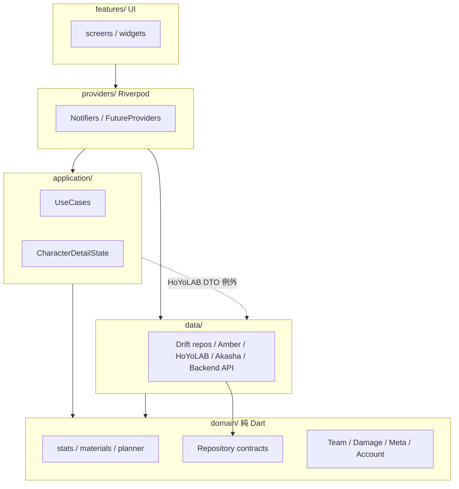
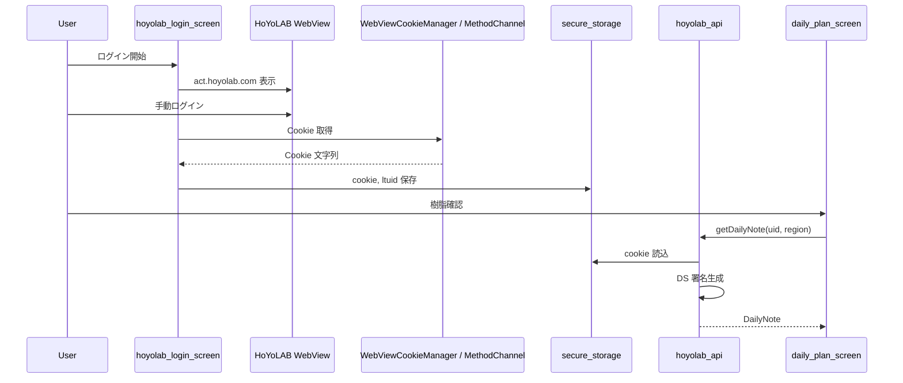
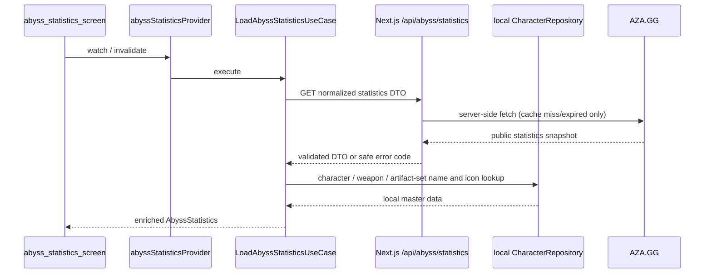

# Architecture — Genshin Builder Mobile

原神育成管理の **非公式** Flutter アプリ。  
仕様の正は Web 版 `../genshin-builder-app/`。参考実装は [genshin_material](https://github.com/chika3742/genshin_material)（MIT 相当のオープンソース。コードは **コピーせず概念のみ参考** し、本プロジェクト用に書き直す）。

## Cross-platform identity (proposed)

Web/Flutter共通account、端末別session、匿名昇格、同期境界、Daily Plan共有の設計判断は、リポジトリ共通の [`../docs/architecture/CROSS_PLATFORM_IDENTITY.md`](../docs/architecture/CROSS_PLATFORM_IDENTITY.md) と [`../docs/architecture/ACCOUNT_SYNC_THREAT_MODEL.md`](../docs/architecture/ACCOUNT_SYNC_THREAT_MODEL.md) を正とする。`localUserId`/`clientScope`は端末内・cache scopeであり認証情報ではない。HoYoLAB Cookie/UIDはGenshin Builder認証・同期から除外する。実装は未着手で、Drift migrationやprovider/secret追加をこの文書は許可しない。

---

## 1. 全体像


```mermaid
flowchart TB
  subgraph features [features/ UI]
    UI[screens / widgets]
  end

  subgraph providers [providers/ Riverpod]
    N[Notifiers / FutureProviders]
  end

  subgraph application [application/]
    UC[UseCases]
    State[CharacterDetailState]
  end

  subgraph domain [domain/ 純 Dart]
    Calc[stats / materials / planner]
    Ports[Repository contracts]
    Future[Team / Damage / Meta / Account]
  end

  subgraph data [data/]
    Impl[Drift repos / Amber / HoYoLAB / Akasha / Backend API]
  end

  features --> providers
  providers --> application
  providers --> data
  application --> domain
  application -.->|HoYoLAB DTO 例外| data
  data --> domain
  Impl --> Ports
```

層ルールの詳細は `AGENTS.md` を参照。

---

## 2. Phase 分け

| Phase | スコープ | 完了条件 |
|-------|----------|----------|
| **Phase 1** | 育成 UI + 素材計算 + ブックマーク + Amber 同期 + **Drift DB** | Web と同じ数値・同じブックマーク仕様でキャラ詳細が動作 |
| **Phase 2** | HoYoLAB 連携（WebView ログイン・dailyNote・設定 UI） | WebView ログイン → Cookie 保存 → dailyNote 表示 |
| Phase 3（将来） | 聖遺物スコア・Firebase 等 | 未定 |

### Phase 1 — 詳細

| 領域 | 内容 | Web 参照 |
|------|------|----------|
| **ドメイン** | Lv/突破/天賦/武器 EXP・範囲合算 | `level-progression.ts`, `talent-progression.ts`, `material-requirements.ts`, `weapon-exp.ts` |
| **DB** | Drift（Prisma スキーマ相当 + bookmarks） | `prisma/schema.prisma`, `bookmark-storage.ts` |
| **同期** | Project Amber → Drift upsert | `api/project-amber.ts`, `sync.ts`, `sync-upgrade.ts` |
| **UI** | キャラ詳細（Lv/天賦/武器スライダー、次段階/範囲素材、ブックマーク） | `DetailEditor`, `LevelMaterialsPanel`, `TalentSection`, `WeaponSection`, `MarkSlider` |
| **ブックマーク** | materialId 合算、キャラアイコン、sourceKey 規約 | `bookmark-utils.ts`, `MaterialBookmarkContext`, `HomeWithBookmarks` |

**Phase 1 でやらないこと**: Cookie / UID / HoYoLAB API / DS 署名

### Phase 2 — 詳細（今回: 設計 + 骨組みまで）

| 領域 | 内容 | genshin_material 参考 |
|------|------|------------------------|
| **WebView ログイン** | HoYoLAB にログインし Cookie 取得 | Pigeon `HoyolabIntegrationApi.fetchCookie()` + ネイティブ WebView |
| **Secure Storage** | Cookie・region・uid を端末内暗号化保存 | `flutter_secure_storage` |
| **API クライアント** | dailyNote（樹脂・デイリー）、verifyLToken | `lib/core/hoyolab_api.dart`（DS salt / app_version は自前定数で管理） |
| **UI** | 設定 → ログイン、今日 → 樹脂ウィジェット | pages 相当を features/hoyolab に再構成 |

**Phase 2 骨組み** = インターフェース・空実装・ルート・Provider まで。API バージョン追従は設定画面から app_version を更新できる設計を検討。

---

## 3. ディレクトリ構成（目標）

```
genshin-builder-mobile/
├── lib/
│   ├── main.dart
│   ├── app.dart
│   ├── router.dart
│   │
│   ├── domain/                    # 純 Dart（Flutter/DB 非依存）
│   │   ├── level_config.dart
│   │   ├── level_progression.dart
│   │   ├── talent_progression.dart
│   │   ├── material_requirements.dart
│   │   ├── weapon_exp.dart
│   │   └── models/
│   │
│   ├── data/
│   │   ├── db/                      # Drift（Phase 1）
│   │   │   ├── app_database.dart
│   │   │   ├── tables/
│   │   │   └── daos/
│   │   ├── amber/
│   │   ├── sync/
│   │   ├── repositories/
│   │   ├── hoyolab/                 # Phase 2 骨組み
│   │   │   ├── hoyolab_api.dart
│   │   │   ├── hoyolab_auth.dart    # DS 署名
│   │   │   ├── hoyolab_session.dart
│   │   │   └── models/daily_note.dart
│   │   └── secure/                  # Phase 2 骨組み
│   │       └── secure_storage_service.dart
│   │
│   ├── platform/                    # Phase 2 骨組み
│   │   └── pigeon/
│   │       ├── hoyolab_integration.dart   # @HostApi 定義
│   │       └── hoyolab_integration.g.dart   # codegen
│   │
│   ├── features/
│   │   ├── growth/                  # 今日・育成ハブ・育成計画
│   │   ├── characters/
│   │   │   ├── character_list_screen.dart
│   │   │   ├── character_detail_screen.dart
│   │   │   └── widgets/             # Level/Talent/Weapon パネル分割
│   │   ├── bookmarks/
│   │   ├── more/                    # ガチャ・イベント・連携・設定の入口
│   │   ├── settings/
│   │   └── hoyolab/                 # Phase 2 骨組み
│   │       ├── hoyolab_login_screen.dart
│   │       └── widgets/daily_note_card.dart
│   │
│   └── providers/
│
├── pigeon/hoyolab_integration.dart    # Pigeon 入力（Phase 2）
├── docs/
│   ├── PHASE1_IMPLEMENTATION.md
│   ├── PHASE2_HOYOLAB.md
│   └── AGENT_MEMORY.md
├── ARCHITECTURE.md
└── test/domain/
```

---

## 4. データ層

### 4.1 ランタイム DB（Drift）

**現状**: ランタイムは Drift（`lib/data/db/app_database_facade.dart` → `drift/app_database.dart`）。  
共有: `lib/data/db/upgrade_serde.dart` で突破 JSON の encode/decode を一元化。

| テーブル | 用途 |
|----------|------|
| `characters`, `weapons`, `materials` | Amber マスタ |
| `character_upgrades`, `weapon_upgrades`, `level_exp_segments` | 突破・天賦・EXP |
| `user_progress` | 育成スライダー状態 |
| `material_bookmarks` | 素材ブックマーク |
| `sync_logs` | 同期履歴 |
| `app_settings` | 匿名 userId、最終同期時刻（Phase 2 で HoYoLAB 設定キー追加） |

Codegen: `dart run build_runner build`

### 4.2 Project Amber

- Base: `https://gi.yatta.moe`
- 一覧: `/avatar`, `/weapon`, `/material`
- 詳細: `/avatar/{id}`, `/weapon/{id}` → promotes / talents JSON
- Web と同一正規化（元素・武器種マップ）

### 4.3 HoYoLAB（Phase 2）


```mermaid
sequenceDiagram
  participant User
  participant LoginUI as hoyolab_login_screen
  participant WebView as HoYoLAB WebView
  participant Cookie as WebViewCookieManager / MethodChannel
  participant Secure as secure_storage
  participant API as hoyolab_api
  participant Today as daily_plan_screen

  User->>LoginUI: ログイン開始
  LoginUI->>WebView: act.hoyolab.com 表示
  User->>WebView: 手動ログイン
  LoginUI->>Cookie: Cookie 取得
  Cookie-->>LoginUI: Cookie 文字列
  LoginUI->>Secure: cookie, ltuid 保存
  User->>Today: 樹脂確認
  Today->>API: getDailyNote(uid, region)
  API->>Secure: cookie 読込
  API->>API: DS 署名生成
  API-->>Today: DailyNote
```

**DS 署名**（グローバル版、参考実装と同原理・自前実装）:

```
salt = "okr4obncj8bw5a65hbnn5oo6ixjc3l9w"  # 中国版とは異なる
t = unix_timestamp
r = random 6 digits
q = query string (sorted)
c = md5("salt={salt}&t={t}&r={r}&b={body}&q={q}")
DS = "{t},{r},{c}"
```

**主要エンドポイント（Phase 2 優先）**:

| API | URL | 用途 |
|-----|-----|------|
| dailyNote | `bbs-api-os.hoyolab.com/.../dailyNote` | 樹脂・コイン・デイリー |
| verifyLToken | `passport-api-sg.hoyolab.com/.../verifyLToken` | ログイン有効性 |
| getUserGameRoles | `api-account-os.hoyolab.com/.../getUserGameRolesByLtoken` | UID / region 取得 |

**セキュリティ**:

- Cookie は `flutter_secure_storage` のみ（SharedPreferences 禁止）
- ログ・Crashlytics に Cookie / DS を出さない
- レート制限: `ApiRequestQueue`（500ms 間隔）を参考に自前実装

### 4.4 深境螺旋統計（AZA.GG）


```mermaid
sequenceDiagram
  participant UI as abyss_statistics_screen
  participant Riverpod as abyssStatisticsProvider
  participant UseCase as LoadAbyssStatisticsUseCase
  participant Backend as Next.js /api/abyss/statistics
  participant Master as local CharacterRepository
  participant AZA as AZA.GG

  UI->>Riverpod: watch / invalidate
  Riverpod->>UseCase: execute
  UseCase->>Backend: GET normalized statistics DTO
  Backend->>AZA: server-side fetch (cache miss/expired only)
  AZA-->>Backend: public statistics snapshot
  Backend-->>UseCase: validated DTO or safe error code
  UseCase->>Master: character / weapon / artifact-set name and icon lookup
  Master-->>UseCase: local master data
  UseCase-->>UI: enriched AbyssStatistics
```

- Domain: `domain/abyss/abyss_statistics.dart` と `AbyssStatisticsRepository` は純 Dart
- Data: `BackendAbyssStatisticsApi` は `GENSHIN_BUILDER_API_BASE_URL` の同一バックエンドだけを呼ぶ。AZA 固有 JSON や認証情報を Flutter へ持ち込まない
- Application: AZA の ID を既存ローカルマスタ（キャラ・武器・聖遺物セット）の表示名・アイコンへ結合し、見つからない ID は安全な ID 表示へフォールバック
- UI: loading / empty / error / stale / retry、取得時刻、期間、サンプル数、参考統計の免責、`Statistics data provided by AZA.GG` を表示
- 比率の内部単位は 0〜1。UI だけで百分率へ変換する
- upstream に存在しないゲームバージョンと編成使用回数はモデル化しない。`sourceApiVersion` は AZA API 仕様版である

---

## 5. ドメイン & ブックマーク仕様（Web 完全準拠）

### 5.1 計算

- スライダー目盛り: `LEVEL_MARKS`, `TALENT_MARKS`（`level-config.ts`）
- 次段階: `getNextStageRequirements`
- 範囲合算: `getRangeLevelRequirements` / `getRangeTalentRequirements`
- モラ ID: `__mora__`

### 5.2 ブックマーク sourceKey（Web `bookmark-utils.ts`）

| 種別 | 形式 |
|------|------|
| 範囲 | `range:{kind}:{targetId}[:{subLabel}]:{from}-{to}` |
| 個別 | `item:{kind}:{targetId}[:{subLabel}]:{scope}:{materialId}` |

`kind`: `character-level` | `weapon-level` | `talent`

合算表示: `materialId` 単位。キャラは `BookmarkCharacterSource[]` をユニーク集約。

---

## 6. UI 移植マップ（Web → Flutter）

| Web コンポーネント | Flutter |
|-------------------|---------|
| `DetailEditor` | `character_detail_screen` + `widgets/detail_editor_body.dart` |
| `LevelSlider` / `MarkSlider` | `features/shared/mark_slider.dart` |
| `LevelMaterialsPanel` | `widgets/level_materials_panel.dart` |
| `TalentSection` + `TalentMaterialsPanel` | `widgets/talent_section.dart` |
| `WeaponSection` | `widgets/weapon_section.dart` |
| `CultivationBookmarkButton` | 範囲ブックマーク + `BookmarkRangeDialog` |
| `BookmarkMaterialsSidebar` | `bookmarks_screen` + `home` 概要 |
| `MaterialBookmarkContext` | `domain/models/bookmark.dart` |

---

## 7. 依存パッケージ（目標）

```yaml
# Phase 1
flutter_riverpod, go_router, http
drift, drift_flutter, sqlite3_flutter_libs
path_provider, cached_network_image, uuid, intl

# Phase 2 追加
flutter_secure_storage
webview_flutter          # または flutter_inappwebview
crypto                   # DS md5
pigeon                   # dev — ネイティブ Cookie 取得
```

---

## 8. テスト方針

| 層 | 方針 |
|----|------|
| `domain/` | Web と数値一致（既存 `test/domain/*`） |
| `data/hoyolab/` | DS 署名の golden test、dailyNote JSON パース |
| Drift | in-memory DB で repository テスト |
| E2E | Phase 2: モック Cookie で dailyNote UI |

---

## 9. ライセンス・参考コード

- [genshin_material](https://github.com/chika3742/genshin_material): HoYoLAB 連携の **設計参考**。ソースの直接転載は行わず、API 仕様・DS アルゴリズム・Pigeon パターンを理解した上で本プロジェクト用に新規記述する。
- 本アプリ README に非公式ファンツールである旨を明記（miHoYo / HoYoverse 非関与）。

---

## 10. 現状 scaffold との差分（Phase 1 実装タスク）

| 項目 | 現状 | Phase 1 で変更 |
|------|------|----------------|
| DB | `sqflite` 直書き | **Drift** + DAO |
| キャラ詳細 UI | 簡易版 | Web 同等のパネル分割・武器/天賦/範囲ブックマーク |
| sourceKey | 簡略 prefix | **Web 準拠**の `bookmark-utils` 移植 |
| Amber 同期 | キャラ upgrade 20件制限 | 全件 or 設定可能に |
| HoYoLAB | プレースホルダのみ | Phase 2 骨組みファイル追加 |

---

## 11. ナビゲーションとルーティング

常時表示するボトムナビは、ユーザーの目的に合わせて次の5タブに固定する。

| タブ | 役割 | 主な入口 |
|------|------|----------|
| 今日 | 今やる行動と日次状況 | AI提案、今日のリスト、樹脂・デイリー |
| キャラ | 育成対象を選ぶ | キャラ一覧、キャラ詳細 |
| 育成 | 計画・収集・振り返り | 曜日素材、ルート、ブックマーク、聖遺物、履歴、健康診断 |
| 編成 | パーティ作成と分析 | 編成、育成優先度、深境螺旋統計 |
| その他 | 補助情報と管理 | ガチャ、開催中イベント、冒険状況、HoYoLAB、設定 |

`GrowthHubScreen` と `MoreScreen` が第2階層の入口をまとめる。通常UIでは重複するドロワー導線を表示せず、詳細画面はAppBarの戻る操作とボトムナビで移動する。旧ドロワー実装は既存ディープリンク／Back回帰の互換層としてのみ残す。

| パス | 画面 | タブ |
|------|------|------|
| `/` | 今日 | 今日 |
| `/daily-plan` | 今日（通知・旧リンク互換） | 今日 |
| `/characters` | キャラ一覧 | キャラ |
| `/characters/:id` | キャラ詳細 | キャラ |
| `/growth` | 育成ハブ | 育成 |
| `/daily` | 今日の曜日素材 | 育成 |
| `/bookmarks` | 素材ブックマーク | 育成 |
| `/artifacts` | 聖遺物 | 育成 |
| `/growth-route` | 育成ルート | 育成 |
| `/growth-timeline` | 成長履歴 | 育成 |
| `/account-health` | アカウント健康診断 | 育成 |
| `/teams` | 編成 | 編成 |
| `/team-priority` | 編成育成優先度 | 編成 |
| `/abyss` | 深境螺旋統計 | 編成 |
| `/more` | その他ハブ | その他 |
| `/gacha` | ガチャ | その他 |
| `/settings` | 設定 | その他 |
| `/settings/hoyolab` | HoYoLAB連携 | その他 |

旧ホームで開始していたバックグラウンドマスタ修復、曜日素材prefetch、HoYoLAB DailyNote prefetchは`DailyPlanScreen`へ移し、ナビ再編後も起動時の挙動を維持する。

---

## 12. おすすめ編成

`application/team_recommendations/normalize_simulation_builds.dart`がHoYoLAB detailを端末内で戦闘DTOへ縮約する。Cookie、UID、アカウント情報、未加工レスポンスは型に存在せず、`BackendTeamRecommendationApi`へ渡らない。聖遺物の安定したsetIdをGame Recordから取得できない場合はセット名から推測せず、空のsetsと`partial` / `artifactSets`を送る。

`TeamRecommendationController`はPOSTでJobを作成し、GETを2秒間隔・最大6分の有限回pollingする。画面破棄後または新しい計算開始後は古いresponseをstateへ反映せず、次のpollingを行わない。queued/running中は計算ボタンを無効化する。UIはqueued/running/completed/failed/expired、再試行、所持キャラ、上半/下半、単体/複数、評価方針、入力品質、ローテーション信頼度、AZA.GGクレジットを表示する。おすすめ編成はAZA/ルール候補のみ（gcsim廃止）。既存の編成保存や深境螺旋画面とは独立する。

---

## 13. 今日やること AI 提案

`GenerateDailyPlanUseCase` は既存の曜日素材、週ボス、育成目標、`UpgradeOption`、樹脂見積、ブックマークを統合し、通常コードだけで最大20件の安定ID付き候補を作る。`BackendDailyPlanEnrichApi` は匿名化済みスコープと必要最小限の構造化フィールドだけを同一バックエンドの `POST /api/daily-plan/enrich` へ送り、Cookie、UID、未加工HoYoLABレスポンスを送らない。

サーバー応答は未知フィールド、未知・重複ID、当日実行不可、樹脂・時間超過、Markdown/HTML/URLを拒否する。通信失敗、AI無効、検証失敗時は `buildDeterministicDailyPlanProposal` が同じ候補から通常ルールで提案する。

提案は既存の `DailyPlanScreen` と `DailyPlanItem` を再利用し、`DailyPlanProposalPanel` で「今日の最優先」1件を先頭に強調、「次にやること」を最大2件、それ以降を件数付き展開で表示する。初期表示の理由はローカル事実から決定的に作るバッジ最大2個と一行理由に限定し、AI自由文、提案方法、生成時刻、警告は「AIがこの順番にした理由」内だけに置く。見送り候補も初期非表示とし、内部コードではなく自然な日本語理由に変換する。候補取得中や失敗時は通常ルール提案を同じ階層で表示し、画面全体をエラーにしない。

生成だけでは進捗・目標・完了状態を変更しない。「今日のリストに追加」後だけ、検証済み提案を既存 `app_settings` へ日付・匿名スコープ・plan fingerprint付きで保存し、既存の `DailyPlanItem` IDと完了キーを維持したまま並びと理由へ反映する。候補、進捗、樹脂、日付、rules版が変われば採用済み提案は自動的に無効になる。DBマイグレーションは不要。

共通DTOは `schemaVersion: 1` と `proposalFingerprint` を必須とする。Flutterは候補生成時のfingerprintをリクエストへ含め、応答で同値を確認し、採用直前にも現在planから再計算して一致しないstale proposalを保存せず再生成する。Web/Mobile parserは `shared/domain-golden/daily-plan-proposal-v1.json` を共有fixtureとして利用し、schema不一致をfail-closedにする。
